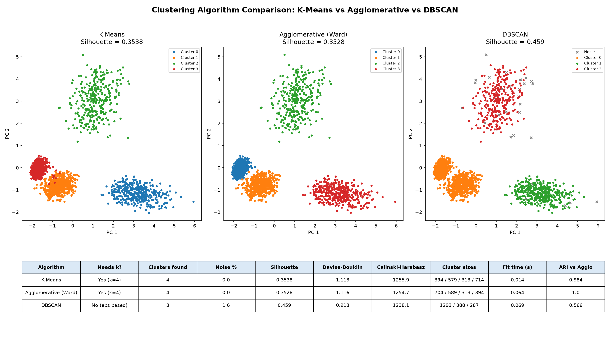
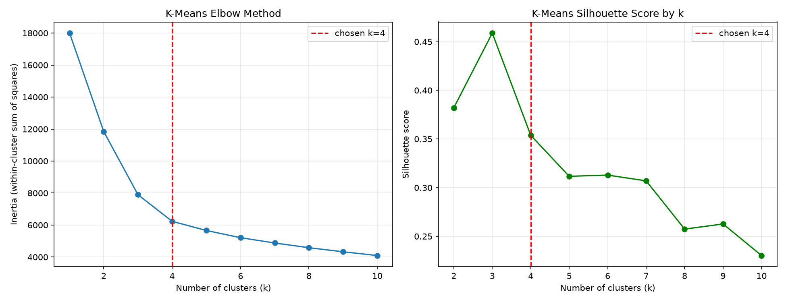

# Credit Card Customer Behaviour Segmentation

**Unsupervised customer segmentation using Agglomerative Hierarchical Clustering, benchmarked against K-Means and DBSCAN**

An end-to-end machine learning pipeline that discovers natural behavioural segments among credit-card customers — without any predefined labels — and translates them into interpretable business profiles and recommendations.

---

## Table of Contents

- [Overview](#overview)
- [Key Results](#key-results)
- [Algorithm Comparison](#algorithm-comparison)
- [Project Structure](#project-structure)
- [Methodology](#methodology)
- [Installation](#installation)
- [Usage](#usage)
- [Module Reference](#module-reference)
- [Dataset](#dataset)
- [Evaluation](#evaluation)
- [Limitations](#limitations)
- [Tech Stack](#tech-stack)


---

## Overview

Financial institutions often have large volumes of transaction data but no ground-truth label describing customer type (e.g. "premium," "cash-advance-dependent," "low-activity"). This project applies **unsupervised learning** — specifically **Agglomerative Hierarchical Clustering** — to segment ~2,000 credit-card holders based on 9 behavioural features, then profiles each resulting cluster and generates rule-based business recommendations.

**Problem type:** Unsupervised clustering (no target variable)
**Main algorithm:** Agglomerative Hierarchical Clustering (Ward linkage)
**Compared against:** K-Means and DBSCAN, on the same scaled data
**Cluster selection:** Dendrogram inspection + Silhouette Score
**Output:** Cluster profiles, visualizations, and auto-generated business recommendations

---

## Key Results

Running the full pipeline on the dataset produces **4 distinct, interpretable customer segments**:

| Cluster | Size | Behaviour Profile | Recommended Action |
|---|---|---|---|
| 0 | 35.2% | Low balance, low purchases, low credit limit | Basic engagement campaigns |
| 1 | 29.4% | Moderate spend, high full-payment rate | Loyalty offers / credit limit increases |
| 2 | 15.7% | High cash-advance usage and frequency | Financial-product education |
| 3 | 19.7% | High purchases, high credit limit, high payments | Premium services / retention priority |

Silhouette scores were evaluated across `k = 2..7`; `k = 3` produced the mathematically highest score (0.459), while `k = 4` (0.353) was selected as the final model for stronger business interpretability — consistent with the project's evaluation philosophy of balancing statistical separation with actionable insight.

---

## Algorithm Comparison

All three algorithms are fitted on the **same standardized features** (`k = 4` for K-Means and Agglomerative; `eps = 1.5`, `min_samples = 10` for DBSCAN) and summarized in one figure and one table:



| Metric | K-Means | Agglomerative (Ward) | DBSCAN |
|---|---|---|---|
| Needs `k` upfront? | Yes (k=4) | Yes (k=4) | No (uses `eps`) |
| Clusters found | 4 | 4 | 3 |
| Noise points | 0% | 0% | 1.6% |
| Silhouette (higher is better) | 0.3538 | 0.3528 | 0.4590 * |
| Davies-Bouldin (**lower** is better) | 1.113 | 1.116 | 0.913 * |
| Calinski-Harabasz (higher is better) | 1255.9 | 1254.7 | 1238.1 * |
| Cluster sizes | 394 / 579 / 313 / 714 | 704 / 589 / 313 / 394 | 1293 / 388 / 287 |
| Agreement with Agglomerative (ARI) | 0.984 | 1.000 | 0.566 |

\* DBSCAN metrics are computed **after removing noise points** and on 3 clusters instead of 4, so they are not a like-for-like comparison with the other two columns.

**How to read this**

- **K-Means and Agglomerative agree almost completely** (ARI = 0.984). Both minimize within-cluster variance, and the clusters here are roughly round and well separated, so they land on nearly the same segments.
- **DBSCAN scores higher, but the comparison is not fair.** It finds only 3 clusters, and one of them holds about 65% of all customers, which is too coarse for targeted marketing. Its useful contribution is the **32 noise points**, which independently support the IQR outlier analysis.
- **Final model:** Agglomerative Clustering with `k = 4`. The dendrogram shows the merge hierarchy, and the 4 segments are easy to explain to a business audience.

Supporting plots: `kmeans_elbow_curve.png` (elbow + silhouette by `k`), `kmeans_clusters.png` (K-Means in PCA space with centroids), `dbscan_pca.png` (DBSCAN with noise marked).



---

## Project Structure

```
credit_card_segmentation/
│
├── data/
│   ├── README.md                     Dataset source and setup instructions
│   └── credit_card_customers.csv     Input data (user-provided or generated)
│
├── notebooks/
│   └── customer_segmentation.ipynb   Step-by-step exploratory notebook
│
├── src/
│   ├── __init__.py
│   ├── config.py                     Centralized paths and constants
│   ├── data_loader.py                Data loading and initial inspection
│   ├── preprocessing.py              Cleaning, feature selection, scaling
│   ├── clustering.py                 Core pipeline: dendrogram, clustering, profiling
│   ├── visualization.py              EDA and cluster visualization plots
│   ├── business_rules.py             Rule-based cluster labeling and recommendations
│   └── generate_sample_data.py       Synthetic dataset generator for testing
│
├── outputs/                          Generated artifacts (plots, CSVs)
├── tests/
│   └── test_preprocessing.py         Unit tests for preprocessing
├── requirements.txt
└── README.md
```

---

## Methodology

The pipeline follows a standard unsupervised-learning workflow:

```
Dataset → Data Understanding → Cleaning → EDA → Feature Selection
   → Standardization → Dendrogram → Cluster Count Selection
   → Agglomerative Clustering → Cluster Labels → Visualization
   → K-Means and DBSCAN Comparison → Cluster Profiling → Evaluation
   → Business Recommendations
```

**1. Data Cleaning**
Missing values in `MINIMUM_PAYMENTS` and `CREDIT_LIMIT` are imputed using the **median**, chosen over the mean because financial variables are typically right-skewed by a small number of high-value customers.

**2. Feature Selection**
Nine behavioural features are retained (`BALANCE`, `PURCHASES`, `CASH_ADVANCE`, `PURCHASES_FREQUENCY`, `CASH_ADVANCE_FREQUENCY`, `PURCHASES_TRX`, `CREDIT_LIMIT`, `PAYMENTS`, `PRC_FULL_PAYMENT`). `CUST_ID` is excluded as it is an identifier, not a behavioural signal.

**3. Standardization**
All features are scaled using `StandardScaler`:

  z = (x − μ) / σ

This is required because Agglomerative Clustering relies on distance calculations; without scaling, features with larger numeric ranges (e.g. `CREDIT_LIMIT`) would dominate the distance metric.

**4. Hierarchical Clustering**
A dendrogram is built using **Ward linkage** with **Euclidean distance**, which minimizes the increase in within-cluster variance at each merge step, tending to produce compact, evenly-sized clusters.

**5. Cluster Count Selection**
The number of clusters is chosen by combining:
- Visual inspection of the dendrogram for a large merge-distance gap
- Silhouette Score across a range of `k` values
- Business interpretability of the resulting profiles

**6. Algorithm Comparison**
K-Means (elbow method + silhouette across `k = 1..10`) and DBSCAN (density-based, marks noise as `-1`) are run on the same scaled data. Silhouette, Davies-Bouldin, Calinski-Harabasz, cluster sizes and the Adjusted Rand Index (agreement between methods) are collected in one table.

**7. Cluster Profiling**
Each cluster's mean feature values are computed to translate anonymous numeric labels (0, 1, 2, 3) into interpretable behavioural profiles.

**8. Business Recommendations**
A transparent, rule-based system (`business_rules.py`) compares each cluster's averages against the overall population average using fixed thresholds (e.g. cash advance > 1.5× average → "cash-advance heavy") to generate a label and a suggested action — fully explainable, with no black-box model involved.

---

## Installation

```bash
git clone <repository-url>
cd credit_card_segmentation
pip install -r requirements.txt
```

**Requirements:** Python 3.9+

---

## Usage

### 1. Provide the dataset

**Option A — Real data (recommended)**
Download from Kaggle: [Credit Card Dataset for Clustering](https://www.kaggle.com/datasets/arjunbhasin2013/ccdata)
Save as `data/credit_card_customers.csv`.

**Option B — Synthetic data (for testing without Kaggle access)**
```bash
python src/generate_sample_data.py
```

### 2. Run the full pipeline

```bash
cd src
python clustering.py
```

or, from the project root, as a module:

```bash
python -m src.clustering
```

This executes the complete workflow and writes the following to `outputs/`:

| File | Description |
|---|---|
| `correlation_heatmap.png` | Feature correlation matrix |
| `outlier_boxplots.png` | Boxplots showing IQR outliers per feature |
| `dendrogram.png` | Hierarchical merge structure |
| `cluster_plot.png` | 2D scatter of clusters (PURCHASES vs CREDIT_LIMIT) |
| `pca_clusters.png` | PCA-reduced 2D cluster visualization (Agglomerative) |
| `kmeans_elbow_curve.png` | K-Means elbow curve and silhouette score by `k` |
| `kmeans_clusters.png` | K-Means clusters in PCA space, with centroids |
| `dbscan_pca.png` | DBSCAN clusters in PCA space, noise marked as x |
| `algorithm_comparison.png` | **One-page comparison** of K-Means, Agglomerative and DBSCAN |
| `algorithm_comparison.csv` | Metrics table behind the comparison figure |
| `cluster_profile.csv` | Per-cluster averages, labels, and recommendations |
| `dbscan_profile.csv` | Per-cluster averages for DBSCAN clusters and noise |

> **Note:** `outputs/*.png` and `outputs/*.csv` are listed in `.gitignore` because they are generated files. To commit a result you want to show on GitHub, use `git add -f outputs/<file>`.

**Command-line options**

| Option | Default | Meaning |
|---|---|---|
| `--k` | 4 | Number of clusters for Agglomerative and K-Means |
| `--eps` | 1.5 | DBSCAN neighborhood radius |
| `--min-samples` | 10 | DBSCAN minimum neighbors for a core point |
| `--no-kmeans-comparison` | off | Skip the K-Means step |
| `--no-dbscan-comparison` | off | Skip the DBSCAN step |

```bash
python -m src.clustering --k 3 --eps 1.2 --min-samples 8
```

The comparison table and figure are only generated when both K-Means and DBSCAN steps are enabled.

### 3. Explore interactively

```bash
jupyter notebook notebooks/customer_segmentation.ipynb
```

---

## Module Reference

| Module | Responsibility |
|---|---|
| `config.py` | Single source of truth for file paths (via `pathlib`) and shared constants |
| `data_loader.py` | `load_data()`, `inspect_data()` |
| `preprocessing.py` | `clean_data()`, `select_features()`, `scale_features()`, `detect_outliers()` |
| `clustering.py` | `build_dendrogram()`, `find_best_k()`, `train_agglomerative()`, `compare_with_kmeans()`, `kmeans_elbow_data()`, `compare_with_dbscan()`, `build_algorithm_comparison()`, `profile_clusters()`, `run_pipeline()` |
| `visualization.py` | `plot_correlation_heatmap()`, `plot_two_feature_scatter()`, `plot_pca_clusters()`, `plot_outlier_boxplots()`, `plot_dbscan_pca()`, `plot_kmeans_elbow()`, `plot_kmeans_clusters()`, `plot_algorithm_comparison()` |
| `business_rules.py` | `generate_business_recommendations()`, `evaluate_cluster_health()`, `profile_dbscan_clusters()` |
| `generate_sample_data.py` | Synthetic dataset generator matching the real schema, for pipeline testing |

Imports throughout `src/` use a `try/except` pattern to support execution as a standalone script, as a package module (`python -m src.clustering`), or from within a notebook.

---

## Dataset

**Source:** [Credit Card Dataset for Clustering](https://www.kaggle.com/datasets/arjunbhasin2013/ccdata) (Kaggle)
**Size (real Kaggle data):** ~9,000 active credit-card holders, 6 months of behavioural data, 18 features
**Size (results in this README):** 2,000 customers from the synthetic generator (`src/generate_sample_data.py`), same 18 columns

| Feature | Description |
|---|---|
| `CUST_ID` | Customer identifier (excluded from clustering) |
| `BALANCE` | Account balance |
| `PURCHASES` | Total purchase amount |
| `CASH_ADVANCE` | Amount drawn as cash advance |
| `PURCHASES_FREQUENCY` | Frequency of purchases |
| `CASH_ADVANCE_FREQUENCY` | Frequency of cash advances |
| `CREDIT_LIMIT` | Assigned credit limit |
| `PAYMENTS` | Amount paid by the customer |
| `PRC_FULL_PAYMENT` | Proportion of full-payment behaviour |
| `TENURE` | Customer relationship duration |

There is no target variable — this is by design, as the project's objective is unsupervised discovery of customer segments.

---

## Evaluation

Since clustering has no ground-truth labels, evaluation relies on:

- **Silhouette Score** — measures how well-separated clusters are (range −1 to 1, higher is better)
- **Davies-Bouldin Index** — average similarity between each cluster and its closest neighbor (lower is better)
- **Calinski-Harabasz Index** — ratio of between-cluster to within-cluster spread (higher is better)
- **Adjusted Rand Index (ARI)** — how closely two algorithms' groupings agree (1 = identical)
- **Cluster size distribution** — flags degenerate solutions where one cluster dominates (>80%) or another is negligible (<2%)
- **Dendrogram structure** — visual confirmation of natural separation
- **Business interpretability** — whether each cluster tells a coherent, actionable story

---

## Limitations

- Cluster labels (0, 1, 2, 3) are arbitrary and can change between runs — always compare cluster *profiles*, not numeric IDs.
- The rule-based business recommendations are heuristic starting points, not validated financial conclusions; they should not be used to infer creditworthiness or financial risk..
- The results shown here come from a **synthetic dataset with 4 built-in groups**, so well-separated clusters and high agreement between algorithms are expected. Results on the real Kaggle data will differ and should be re-run and re-interpreted.
- DBSCAN's `eps` and `min_samples` were not tuned exhaustively; different values change the number of clusters and the noise percentage, so its scores are indicative, not final.
- Results depend on the feature set and scaling choices; alternative feature sets may surface different segment structures.

---

## Tech Stack 

- **Python 3.9+**
- **pandas**, **NumPy** — data manipulation
- **scikit-learn** — `StandardScaler`, `AgglomerativeClustering`, `KMeans`, `DBSCAN`, `PCA`, and clustering metrics (silhouette, Davies-Bouldin, Calinski-Harabasz, Adjusted Rand Index)
- **SciPy** — hierarchical clustering (`linkage`, `dendrogram`)
- **Matplotlib**, **Seaborn** — visualization
- **Jupyter** — exploratory analysis
